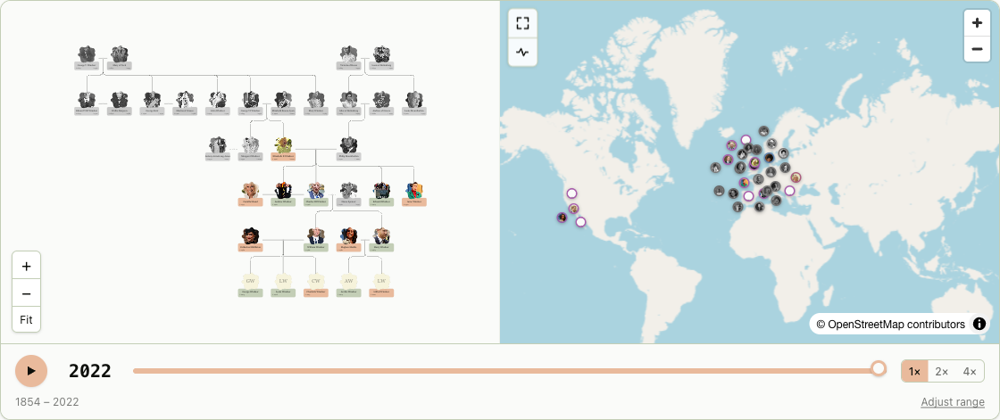
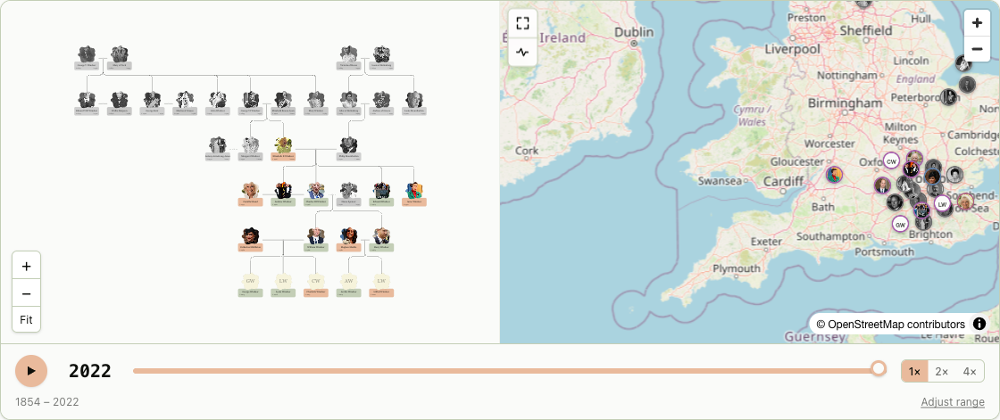

# HeritageAtlas

**Record your family's history and watch it move across a map over time.**

HeritageAtlas is a web app for building a family tree — people, relationships, life
events, dates, and photos — and seeing it as a **synced split view**: an interactive
family graph beside a **historical map with a timeline slider** that replays where your
family lived, decade by decade.



> The screenshots use the bundled **House of Windsor** demo tree (public sample data) — not
> real personal data.

## What it does

- **Interactive family tree** — a clean, auto-laid-out graph (parents, partners, children),
  pan/zoom, with name cards coloured by sex and photo avatars.
- **Historical map** — every located life event is plotted on a real map. Dots are sized so a
  person never covers more than a city's worth of ground: full-size when zoomed in, shrinking
  as you zoom out so positions stay honest.
- **Time-travel slider** — scrub the years and watch people appear, move between places, age,
  and pass on. The tree and map stay in sync.
- **Fuzzy dates** — record "about 1850", "before 1900", "between 1912 and 1915", or just a
  year/month — the kind of imprecision real genealogy is full of.
- **Places** — geocoded via OpenStreetMap, or drop a pin by hand for vanished/renamed places
  (with an optional historical name).
- **GEDCOM import & export** — bring a tree in from another genealogy program, or export yours
  as standard GEDCOM 5.5.1.
- **Sharing** — invite collaborators (viewer/editor) or publish a **password-protected,
  read-only** public link (photos hidden for privacy).
- **Photos** — multiple photos per person in a private storage bucket, with a chosen profile shot.
- **Bilingual** — full English and German UI, switchable in account settings (English / Deutsch).



## How it works

The core is the **split view** at `/trees/[treeId]`: the family graph on the left, the map +
timeline on the right, both driven by the same selected year.

- Each person can have **events** (birth, death, marriage, residence, occupation, custom), each
  optionally tied to a **place** (lat/lng) and a **fuzzy date**.
- For a given year, a [position resolver](src/lib/map/positionResolver.ts) places each person at
  their most recent located event at or before that year — so scrubbing the slider moves the dots.
- The graph layout is computed with [elkjs](https://github.com/kieler/elkjs) (couples share a
  hidden junction node so partners sit on the same rank and children drop below).
- Everything is tenant-scoped to a **tree** and protected by Postgres **row-level security**;
  the browser only ever uses the public (anon) key.

## Tech stack

- **SvelteKit** (Svelte 5 runes) + **TypeScript**
- **Tailwind CSS v4**
- **Supabase** — Postgres, Auth, Storage, Row-Level Security, Edge Functions
- **MapLibre GL** — interactive maps (OpenStreetMap raster tiles)
- **intl-messageformat** — i18n (ICU messages)
- **Vitest** (unit) + **Playwright** (e2e)
- **pnpm**; Node version pinned in [.nvmrc](.nvmrc)

## Data model

Every table is tenant-scoped to a **tree** and guarded by RLS. A few conventions make this
easy to replicate:

- **Short text IDs** — most rows use a `gen_short_id()` default (URL-friendly ids like `m245mw`),
  except `profiles.id` (= the auth user id) and `tree_members` (composite key).
- **Composite foreign keys** `(id, tree_id)` — a person's events, places, partnerships, and
  parent/child links can only ever reference rows **in the same tree**.
- **RLS helpers** — `private.is_tree_member(tree)` and `private.can_edit_tree(tree)`
  (`SECURITY DEFINER`) back every policy; membership lives in `tree_members`, ownership in
  `trees.owner_id`.

| Table                | Purpose                                                                                                                                                    |
| -------------------- | ---------------------------------------------------------------------------------------------------------------------------------------------------------- |
| `profiles`           | One row per auth user (`display_name`, `locale`). Auto-created on signup by a trigger.                                                                     |
| `trees`              | A family tree. Owns everything below. Holds public-share fields (`share_token`, hashed `share_password`, `is_public`).                                     |
| `tree_members`       | Who can access a tree and at what `role` (`owner` / `editor` / `viewer`).                                                                                  |
| `invitations`        | Pending email invites to a tree (accepted → becomes a `tree_members` row).                                                                                 |
| `persons`            | A person: names (given / surname / birth / nickname), `sex`, `notes`, profile photo path.                                                                  |
| `partnerships`       | A couple — `partner_a` + `partner_b` with `status` (`current` / `former`).                                                                                 |
| `parent_child_links` | A directed parent → child edge.                                                                                                                            |
| `places`             | A named location: `lat`/`lng` (nullable until located), optional `historical_name`, `source` (`geocoded` / `manual`).                                      |
| `events`             | A life event on a person: `type`, fuzzy date (`event_date`, `event_date_end`, `event_qualifier`, `event_precision`), optional `place_id`, `label`, `note`. |
| `person_photos`      | Extra photos per person (paths into the `person-photos` storage bucket), ordered.                                                                          |

**Enums:** `tree_role`, `partnership_status`, `event_type` (birth/death/marriage/residence/
occupation/custom), `date_qualifier` (exact/about/before/after/between/estimated),
`date_precision` (day/month/year), `place_source` (geocoded/manual).

Generated TypeScript types for the whole schema live in
[src/lib/supabase/types.ts](src/lib/supabase/types.ts) (regenerate with `pnpm gen:types`).

## Getting started

### Prerequisites

- Node (see [.nvmrc](.nvmrc)) and **pnpm**
- A **Supabase** project (free tier is fine)
- The [Supabase CLI](https://supabase.com/docs/guides/cli) — for migrations, types, and the edge function

### 1. Install

```sh
pnpm install
cp .env.example .env   # then fill in your Supabase values
```

| Variable                          | Where to find it                                          |
| --------------------------------- | --------------------------------------------------------- |
| `PUBLIC_SUPABASE_URL`             | Supabase dashboard → Project Settings → API → Project URL |
| `PUBLIC_SUPABASE_PUBLISHABLE_KEY` | Project Settings → API Keys → "publishable" (anon) key    |

Both are browser-safe; `.env` is git-ignored.

### 2. Set up the database (replicate the schema)

The entire schema — tables, enums, RLS policies, helper functions, and the `person-photos`
storage bucket — lives in [supabase/migrations/](supabase/migrations/). Apply it to your own
project in filename order:

```sh
supabase link --project-ref <your-project-ref>
supabase db push        # applies every migration in order
```

Or, without the CLI, paste each file from `supabase/migrations/` into the dashboard **SQL editor**
in numerical order (`0001` → `0019`).

Notes:

- Migrations `0016_windsor_demo` / `0017_public_demo` seed the **public House of Windsor demo
  tree** that powers the landing page. Skip them if you don't want the sample data.
- Account deletion runs through an Edge Function (it needs the service role to remove the auth
  user). Deploy it once:
  ```sh
  supabase functions deploy delete-account
  ```

### 3. Auth settings

Email/password auth is on by default. For local development, turn **off** "Confirm email"
(Authentication → Providers → Email) so sign-ups work without SMTP — or leave it on and check the
inbox. For production, keep confirmation on and enable leaked-password protection.

### 4. Run

```sh
pnpm dev
```

## Scripts

| Command          | Description                                                   |
| ---------------- | ------------------------------------------------------------- |
| `pnpm dev`       | Start the dev server                                          |
| `pnpm build`     | Production build                                              |
| `pnpm preview`   | Preview the production build                                  |
| `pnpm check`     | Type-check (`svelte-check`)                                   |
| `pnpm lint`      | Prettier check + ESLint                                       |
| `pnpm format`    | Auto-format with Prettier                                     |
| `pnpm test`      | Unit tests (Vitest)                                           |
| `pnpm e2e`       | End-to-end tests (Playwright)                                 |
| `pnpm gen:types` | Regenerate Supabase DB types into `src/lib/supabase/types.ts` |

## Testing

- **Unit** (`pnpm test`) — GEDCOM round-trip on a vendored real-world file, fuzzy dates,
  ancestry-loop prevention, and i18n guards (locale key parity + a lint that fails on any
  hardcoded, untranslated UI string).
- **End-to-end** (`pnpm e2e`) — Playwright against a seeded login: person creation, recursion
  rejection, password-protected sharing, account actions. Put `E2E_EMAIL` / `E2E_PASSWORD` for a
  pre-existing test account in a git-ignored `.env.test` (see [.env.example](.env.example)).

## Internationalisation

UI strings live as flat dot-notation keys in per-area JSON under
[src/lib/i18n/locales/](src/lib/i18n/locales/) (`en/` and `de/`). Add a language by dropping in a
matching folder of files; a test enforces that every locale defines the same keys. The active
language is stored on the user's profile (and mirrored to a cookie for SSR), switchable in
**Account settings** — never in the URL.

## Project layout

```
src/
  lib/
    components/   Svelte UI (MapView, FamilyGraph, Timeline, pickers, …)
    map/          position resolver, marker layout/sizing, map style
    gedcom/       GEDCOM parse / import / export (+ test fixtures)
    graph/        family-graph helpers (e.g. ancestry-cycle detection)
    i18n/         message store, translate(), reactive context, locale JSON
    server/       server-only data loaders & helpers
    supabase/     typed Supabase clients + generated types
  routes/         SvelteKit routes (dashboard, trees, persons, import, share, …)
supabase/
  migrations/     the full schema (apply in order)
  functions/      delete-account edge function
```

See [DESIGN.md](DESIGN.md) for the design spec and [PLAN.md](PLAN.md) for the task-by-task build log.
